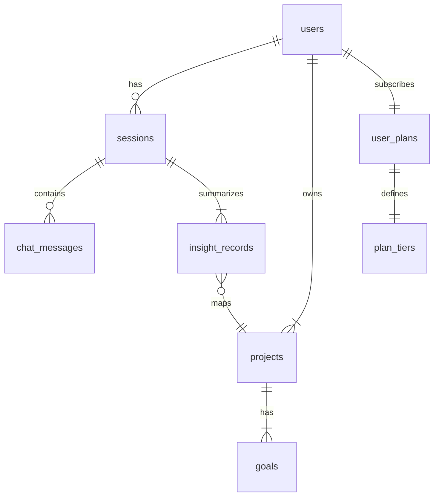

# Dharmagile AI — Functional Specification

*Document status : Draft v0.9  |  Created : 2025‑05‑04  |  Author : Cursor AI agent*

---

## 0. 文書目的 / Purpose

この機能仕様書は、個人開発向け SaaS である **Dharmagile AI** の MVP (6 週間計画) を実装するために必要な機能要件を網羅的に定義する。開発は **Windows 11 + VS Code (ターミナル: PowerShell)** を前提とし、フロントエンドは **Next.js + TailwindCSS + shadcn/ui**、バックエンドは **FastAPI + Supabase**、決済は **Stripe Checkout** を採用する。

---

## 1. 用語定義 / Glossary

| 用語               | 定義                                        |
| ---------------- | ----------------------------------------- |
| **AI Session**   | ユーザーと選択 LLM (GPT‑4 Turbo 等) との単一チャットスレッド。 |
| **Branch**       | AI Session 内で分岐したサブコンテキスト。                |
| **Insight.yaml** | 仏法ベースの自己省察テンプレートで構造化された会話要約。              |
| **Project**      | 人生目的 → 目標 → プロジェクト → タスク の階層内で管理される単位。    |
| **Plan Tier**    | SaaS 課金プラン: Free, Pro, Premium, Lite。     |
| **功徳ポイント**       | ユーザー間リアクションにより授与されるゲーミフィケーションポイント。        |

---

## 2. 背景 / Background

* 生成 AI の会話履歴が散在し、後参照や行動変換が困難。
* Dharmagile AI は **Life Intelligence** ツールとして、対話内容を自動構造化し、目標達成と自己成長を支援するダッシュボードを提供する。

---

## 3. 全体アーキテクチャ / System Overview

```mermaid
flowchart LR
  subgraph Frontend (Next.js)
    UI["shadcn/ui Components"]
    Dash[Dashboard]
    Chat[Chat UI]
    Billing[Subscription Pages]
  end
  subgraph Backend (FastAPI)
    API[REST / WebSocket API]
    Structure[Structure Service]
    Insight[Insight Generator]
  end
  subgraph Data
    SB[(Supabase DB)]
    Storage[(Supabase Storage)]
  end
  subgraph External
    OpenAI[OpenAI API]
    Stripe[Stripe Checkout]
  end
  UI --> Chat --> API
  Dash --> API
  Billing --> Stripe
  API --> SB
  API --> Storage
  API --> Structure --> Insight --> OpenAI
```

---

## 4. 機能一覧 / Function List

| ID   | 機能名             | 概要                                     | MVP Phase  |
| ---- | --------------- | -------------------------------------- | ---------- |
| F‑01 | ユーザー認証          | Supabase Auth (Email/Password, Social) | P1‑Week 2  |
| F‑02 | ChatAI 基本応答     | ユーザー入力 → OpenAI API → 出力               | P1‑Week 2  |
| F‑03 | 入力 / 出力 の後編集    | 履歴セルを編集し再生成                            | P1‑Week 3  |
| F‑04 | ブランチ作成          | 任意メッセージから分岐ツリー生成                       | P1‑Week 3  |
| F‑05 | 履歴保存 / ロード      | Supabase DB に自動保存・ページネーション             | P1‑Week 3  |
| F‑06 | Insight.yaml 生成 | ブランチ末尾で YAML 要約                        | P1‑Week 4  |
| F‑07 | 履歴検索            | 全文 & メタ検索 (PGroonga)                   | P1‑Week 4  |
| F‑08 | プロジェクト生成        | Insight.yaml をプロジェクトに紐付け               | P1‑Week 4  |
| F‑09 | ダッシュボード可視化      | Mermaid グラフ & Stats                    | P3‑Week 5  |
| F‑10 | Stripe 課金       | Checkout & Webhook                     | P2‑Week 4  |
| F‑11 | プラン制御           | 生成回数・プロジェクト数制限                         | P2‑Week 4  |
| F‑12 | 功徳ポイント & リアクション | いいね・慈悲喜捨リアクション                         | Out‑of‑MVP |

---

## 5. ユースケース / Use Cases (主要フロー)

### UC‑01 : Chat で回答を得る

1. 未ログインユーザー → 「サインアップ」。
2. Chat ページでメッセージ送信。
3. OpenAI API 呼び出し → ストリーム表示。
4. ユーザーがブランチ or 編集を選択。
5. 結果が DB に保存。

### UC‑02 : YAML 要約でプロジェクト生成

1. ユーザーがツリー末端を選択し「Generate Insight.yaml」クリック。
2. Structure Service が全履歴を要約 → YAML 生成。
3. ユーザーがプロジェクト候補を確認し保存。

### UC‑03 : サブスク購入

1. ダッシュボードで “Upgrade Plan” 押下。
2. Stripe Checkout 起動。
3. 支払成功 → Webhook で `users.billing_plan` 更新。
4. 機能リミットが即時解除。

---

## 6. 機能詳細 / Functional Details

### 6.1 Chat Module (F‑02,‑03,‑04,‑05)

| 要素        | 説明                                                                               |
| --------- | -------------------------------------------------------------------------------- |
| 入力コンポーネント | shadcn/ui `Input` + Send Button (Ctrl‑Enter)。                                    |
| 出力表示      | Streaming, token‑wise, Markdown render, code block copy。                         |
| 履歴セル編集    | ペンアイコン → Modal Dialog で再入力 → 再生成 API 呼出。                                         |
| ブランチ作成    | 任意セルにツリーアイコン → 新ブランチを左側ツリーに追加。                                                   |
| データモデル    | `chat_messages(id, session_id, branch_id, role, content, parent_id, created_at)` |
| 制限        | Free: 15 generations/day, 3 projects。数超過時に Banner 表示。                            |

### 6.2 Structure Service (F‑06,‑08)

* **入力**: 全メッセージ JSON。
* **プロンプト**: INSIGHT YAML テンプレートをインラインで付加。
* **出力**: YAML → `insight_records` テーブル保存。

### 6.3 Dashboard (F‑09)

* **Mermaid Graph**: Project‐Goal‐Purpose tree (read‑only)。
* **Statistics**: Chat count, generation tokens, active projects (mini cards)。
* **Filters**: Dropdown (Project, Date Range)。

### 6.4 Billing Module (F‑10,‑11)

| 要素               | 説明                                                                      |
| ---------------- | ----------------------------------------------------------------------- |
| プラン一覧            | Free / Pro / Premium / Lite を Card で表示。                                 |
| Checkout 連携      | Stripe Session ID を取得しリダイレクト。                                           |
| Webhook Endpoint | `/api/webhooks/stripe` (FastAPI)                                        |
| Plan Logic       | 中間テーブル `user_plan_limits` に max\_sessions, max\_projects, token\_limit。 |

---

## 7. 画面仕様 / Screen Definitions

1. **LoginPage** : Auth UI (Supabase UI kit)。
2. **ChatPage** : 左 `TreeSidebar` + 中央 `ChatPanel` + 右 `ActionBar`。
3. **DashboardPage** : Header Stats → Purpose Tree (Mermaid) → Recent Insights。
4. **BillingPage** : Plan Cards → Checkout Button。

UI components must inherit base `className="rounded-2xl shadow-sm p-4"` and follow Digital庁 Design Guide.

---

## 8. データ定義 / Data Model (ER 概要)



---

## 9. API 仕様 (REST)

| Method | Endpoint                 | Purpose                       |
| ------ | ------------------------ | ----------------------------- |
| POST   | `/api/chat/generate`     | Generate completion (stream)。 |
| PATCH  | `/api/chat/message/{id}` | Edit & regenerate。            |
| POST   | `/api/chat/branch`       | Create branch。                |
| GET    | `/api/sessions/{id}`     | Fetch messages。               |
| POST   | `/api/insight/generate`  | Generate Insight.yaml。        |
| POST   | `/api/projects`          | Create project from Insight。  |
| GET    | `/api/dashboard/stats`   | Usage stats。                  |
| POST   | `/api/billing/checkout`  | Create Stripe session。        |
| POST   | `/api/webhooks/stripe`   | Stripe Webhook。               |

All endpoints are JSON over HTTPS; authentication via Supabase JWT.

---

## 10. 非機能要件 / Non‑Functional Requirements

| 分類      | 要件                                   |
| ------- | ------------------------------------ |
| パフォーマンス | ダッシュボード初期読込 ≤ 3 秒 (95th percentile)。 |
| セキュリティ  | HTTPS、JWT、AES‑256 at rest。           |
| 可用性     | SLA 99 % (Vercel + AWS)              |
| 国際化     | ja‑JP / en‑US, i18n JSON ファイル。       |
| ロギング    | OpenTelemetry traces, Supabase Logs。 |

---

## 11. 外部インターフェース

* **OpenAI API** : `gpt-4o-turbo` (rate ≈ 15k tokens / min)。
* **Stripe** : PaymentIntent + Subscription.
* **Supabase Auth & Storage** ：画像アップロード, etc.

---

## 12. 制約 / Constraints

* 開発リソース: 2 人, 1 週あたり 5 時間。
* コスト: 初期は無料枠＋最小有料プランで運用。
* 法令: 個人情報保護法, 特商法, Stripe 規約。

---

## 13. 未決事項 / Open Issues

| # | 問題                    | 期日 | 担当  |
| - | --------------------- | -- | --- |
| 1 | 功徳ポイントの演算ロジック詳細       | P3 | TBD |
| 2 | ユーザー感情 UI のリアルタイム集計方法 | P4 | TBD |
| 3 | LLM ベンダーローテーション戦略     | P2 | TBD |

---

> **Next Step** : レビュー後、タスク分割して GitHub Issue 化 → Cursor AI の `@tasks` コマンドで自動生成。
